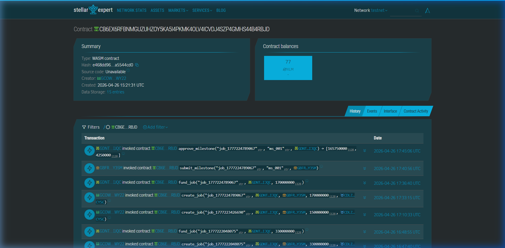
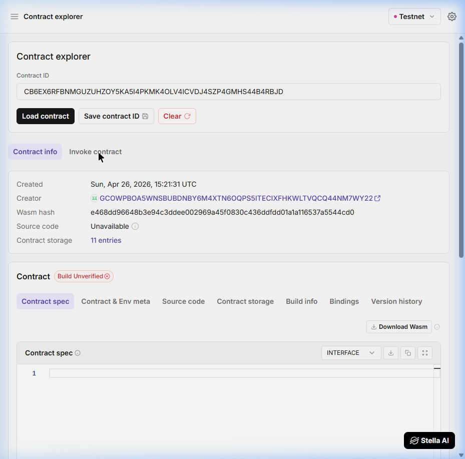

# FreelanceChain

Peer-to-peer freelance escrow payments on Stellar, built with Soroban smart contracts.

> 🚀 **Live App:** [https://frontend-nu-pearl-3s0nq0wsv5.vercel.app](https://frontend-nu-pearl-3s0nq0wsv5.vercel.app)
>
> 📌 **GitHub About:** Add the live app link to the **About** section of this repo so it appears at the top of the GitHub page. *(Repo → ⚙️ Settings icon next to About → Website field)*

---

## Problem

A Filipino freelancer doing graphic design for an overseas client has no guarantee of payment after delivering work. The client either pays upfront and risks getting ghosted, or the freelancer works first and hopes the client doesn't disappear. Traditional escrow services like Escrow.com charge 3–5% fees, take days to settle, and require KYC paperwork that locks out small freelancers. PayPal disputes are slow, biased, and freeze accounts without warning. Both sides lose.

## Solution

FreelanceChain locks XLM into a Soroban smart contract the moment a job is created. The freelancer submits work, the client approves — and payment releases automatically on-chain. No middleman, no trust required, no frozen accounts. Settlement happens in under 5 seconds with fees under $0.01. A 2.5% platform fee is transparently locked at job creation and cannot be changed mid-job.

---

## Demo Flow

1. **Connect** Freighter wallet (Testnet)
2. **Create Job** — Enter freelancer address + XLM amount → ops account registers job on-chain
3. **Fund Escrow** — Client signs via Freighter → XLM locked in smart contract
4. **Submit Work** — Freelancer signs → milestone marked as submitted
5. **Approve & Release** — Client approves → payment auto-transfers to freelancer (minus platform fee)

All confirmed transactions link to [Stellar Expert testnet explorer](https://stellar.expert/explorer/testnet).

---

## Architecture

```
Next.js 16 (App Router)
  ├─ /api/create-job       ← Ops account signs create_job (server-side)
  ├─ /api/build-xdr        ← Builds unsigned XDR for user-signed actions
  ├─ /api/submit-tx        ← Submits signed XDR to Stellar RPC
  └─ /api/get-job          ← Reads on-chain job state (view call)

Soroban Smart Contract (Rust)
  ├─ initialize(admin, fee_bps)
  ├─ create_job(job_id, client, freelancer, amount, token)
  ├─ fund_job(job_id, caller, amount)            ← client signs
  ├─ submit_milestone(job_id, milestone, caller) ← freelancer signs
  ├─ approve_milestone(job_id, milestone, caller)← client signs → pays out
  └─ get_job(job_id)                             ← read-only
```

### XDR Signing Flow (fund / submit / approve)

```
1. User clicks action button in the UI
2. GET  /api/build-xdr  → server builds + simulates → returns unsigned XDR
3. Freighter wallet signs XDR locally (private key never leaves device)
4. POST /api/submit-tx  → submits signed XDR to Stellar testnet RPC
5. UI polls for confirmation → shows tx hash + explorer link
```

---

## Project Structure

```
freelancechain/
├─ contracts/
│   └─ freelance_escrow/
│       ├─ src/
│       │   ├─ lib.rs              # Soroban escrow contract (9 functions)
│       │   └─ test.rs             # 15 test cases
│       ├─ Cargo.toml
│       └─ Makefile
├─ frontend/
│   ├─ app/
│   │   ├─ page.tsx                # Main UI page
│   │   ├─ layout.tsx              # Root layout
│   │   ├─ globals.css             # Tailwind styles
│   │   ├─ components/
│   │   │   ├─ WalletConnect.tsx   # Freighter wallet integration
│   │   │   ├─ JobForm.tsx         # Job creation form
│   │   │   ├─ EscrowFlow.tsx      # Fund → Submit → Approve flow
│   │   │   └─ TxStatus.tsx        # Transaction status display
│   │   └─ api/
│   │       ├─ create-job/route.ts # Server-side job creation
│   │       ├─ build-xdr/route.ts  # XDR builder for wallet signing
│   │       ├─ submit-tx/route.ts  # Signed XDR submission
│   │       └─ get-job/route.ts    # On-chain state reader
│   ├─ package.json
│   ├─ next.config.ts
│   └─ .env.local.example
├─ Cargo.toml                     # Workspace root
├─ DEPLOY.md                      # Step-by-step deployment guide
└─ README.md
```

---

## Smart Contract

### Contract ID (Deployed on Stellar Testnet)

```
CB6EX6RFBNMGUZUHZOY5KA5I4PKMK4OLV4ICVDJ4SZP4GMHS44B4RBJD
```

| Explorer | Link |
|---|---|
| **Stellar Lab** | [View on Stellar Lab](https://lab.stellar.org/r/testnet/contract/CB6EX6RFBNMGUZUHZOY5KA5I4PKMK4OLV4ICVDJ4SZP4GMHS44B4RBJD) |
| **Stellar Expert** | [View on Stellar Expert](https://stellar.expert/explorer/testnet/contract/CB6EX6RFBNMGUZUHZOY5KA5I4PKMK4OLV4ICVDJ4SZP4GMHS44B4RBJD) |

#### Deployed Contract Screenshots

**Stellar Expert** — contract overview with transaction history:



**Stellar Lab** — contract explorer showing contract spec and storage:



### Previously Deployed (Prototype)

```
CBPXD4WLBHOQAX3YRI3Y55LE57ERDT57SLSBP32VFEQNL66PN7MAT26X
```

**Stellar Lab:** [View on Stellar Lab](https://lab.stellar.org/r/testnet/contract/CBPXD4WLBHOQAX3YRI3Y55LE57ERDT57SLSBP32VFEQNL66PN7MAT26X)

### Contract Functions

| Function | Caller | Description |
|---|---|---|
| `initialize(admin, fee_bps)` | Admin | One-time setup, sets platform fee |
| `create_job(job_id, client, freelancer, amount, token)` | Platform (ops) | Registers escrow job on-chain |
| `fund_job(job_id, caller, amount)` | Client | Locks XLM into the contract |
| `submit_milestone(job_id, milestone_id, caller)` | Freelancer | Marks milestone as submitted |
| `approve_milestone(job_id, milestone_id, caller)` | Client | Releases payment to freelancer |
| `get_job(job_id)` | Anyone | Read-only: returns full job state |
| `get_fee()` | Anyone | Read-only: returns current fee rate |
| `get_admin()` | Anyone | Read-only: returns admin address |
| `update_platform_fee(new_fee)` | Admin | Updates global fee (does not affect live jobs) |

### Escrow Status Lifecycle

```
Open ──────→ Funded ──────→ InProgress ──────→ Completed
(create_job)  (fund_job)   (submit_milestone)  (approve_milestone)
                                                  ├─ Net amount → Freelancer
                                                  └─ Platform fee → Admin
```

### Contract Properties

| Property | Description |
|---|---|
| **Conservation of funds** | `net_to_freelancer + platform_fee == funded_amount` always |
| **Fee snapshot** | Fee rate is locked at `create_job` — changing global fee doesn't affect live jobs |
| **Authorization** | Each action requires the correct party's wallet signature (`require_auth()`) |
| **No panics** | All functions return `Result<T, ContractError>` |
| **Events** | Every state change emits an on-chain event |

---

## Stellar Features Used

| Feature | Usage |
|---|---|
| Soroban smart contracts | Escrow logic — lock funds, milestone tracking, auto-release |
| XLM (native asset) | Payment settlement via SEP-41 token interface |
| `require_auth()` | Wallet-based authorization for every state-changing action |
| On-chain events | Audit trail for job creation, funding, submission, approval |
| Persistent storage | Per-job state keyed by `job_id` |

---

## Prerequisites

**For the smart contract:**
- [Rust](https://rustup.rs/) (latest stable) + `wasm32v1-none` target
- [Stellar CLI v25+](https://developers.stellar.org/docs/tools/developer-tools/cli/install-cli)
- Stellar testnet account funded via Friendbot

**For the frontend:**
- Node.js 20+
- [Freighter wallet](https://www.freighter.app/) browser extension, set to **Testnet**
- Testnet XLM (for gas fees)

---

## Quick Start (Reviewers)

> **The contract is already deployed on testnet.** You do NOT need Rust or Stellar CLI to run the frontend. Just clone, configure, and run.

```bash
# 1. Clone the repo
git clone https://github.com/reymarkjpanes/freelancechain.git
cd freelancechain

# 2. Configure environment
cd frontend
cp .env.local.example .env.local
# The .env.local.example is pre-filled with the deployed contract ID
# and testnet ops account — ready to use out of the box.

# 3. Install and run
npm install --force
npm run dev
# → http://localhost:3000
```

**Requirements:** Node.js 20+ and the [Freighter wallet](https://www.freighter.app/) browser extension set to **Testnet**.

> **Note:** `npm install --force` is needed because `@creit.tech/stellar-wallets-kit` has a peer dependency on React 18, but this project uses React 19. The `--force` flag bypasses this — everything works correctly.

---

## Setup (Full Deploy from Scratch)

> Only follow these steps if you want to deploy your own instance of the smart contract. If you just want to run the frontend against the existing deployed contract, use the [Quick Start](#quick-start-reviewers) above.

### 1. Smart Contract — Build & Test

```bash
# Install wasm target
rustup target add wasm32v1-none

# Generate and fund an ops account on testnet
stellar keys generate ops --network testnet
stellar keys fund ops --network testnet

# Build and test
cd contracts/freelance_escrow
cargo test            # All tests must pass
stellar contract build  # Produces .wasm in target/
```

### 2. Smart Contract — Deploy to Testnet

```bash
# Deploy (inside contracts/freelance_escrow/)
stellar contract deploy \
  --wasm ../../target/wasm32v1-none/release/freelance_escrow.wasm \
  --source ops \
  --network testnet

# → Outputs CONTRACT_ID (save this)

# Initialize the contract with 2.5% fee
stellar contract invoke \
  --id <CONTRACT_ID> \
  --source ops \
  --network testnet \
  -- initialize \
  --admin $(stellar keys address ops) \
  --fee_basis_points 250

# Verify — should return 250
stellar contract invoke \
  --id <CONTRACT_ID> \
  --network testnet \
  -- get_fee
```

### 3. Frontend — Configure & Run

```bash
cd frontend
cp .env.local.example .env.local
```

Edit `.env.local` and fill in your own values:

```env
STELLAR_NETWORK=testnet
STELLAR_RPC_URL=https://soroban-testnet.stellar.org
ESCROW_CONTRACT_ADDRESS=<CONTRACT_ID>          # from deploy step
OPS_ACCOUNT_PUBLIC_KEY=<ops public key>        # stellar keys address ops
OPS_ACCOUNT_SECRET_KEY=<ops secret key>        # stellar keys secret ops
XLM_TOKEN_ADDRESS=CDLZFC3SYJYDZT7K67VZ75HPJVIEUVNIXF47ZG2FB2RMQQVU2HHGCYSC
PLATFORM_FEE_BASIS_POINTS=250
```

```bash
npm install --force
npm run dev
# → http://localhost:3000
```

---

## Sample CLI Invocations

```bash
# Create a test job (10 XLM = 100,000,000 stroops)
stellar contract invoke \
  --id CB6EX6RFBNMGUZUHZOY5KA5I4PKMK4OLV4ICVDJ4SZP4GMHS44B4RBJD \
  --source ops \
  --network testnet \
  -- create_job \
  --job_id "demo_001" \
  --client $(stellar keys address ops) \
  --freelancer <FREELANCER_ADDRESS> \
  --total_amount 100000000 \
  --token_address CDLZFC3SYJYDZT7K67VZ75HPJVIEUVNIXF47ZG2FB2RMQQVU2HHGCYSC

# Read job state
stellar contract invoke \
  --id CB6EX6RFBNMGUZUHZOY5KA5I4PKMK4OLV4ICVDJ4SZP4GMHS44B4RBJD \
  --network testnet \
  -- get_job \
  --job_id "demo_001"

# Check platform fee
stellar contract invoke \
  --id CB6EX6RFBNMGUZUHZOY5KA5I4PKMK4OLV4ICVDJ4SZP4GMHS44B4RBJD \
  --network testnet \
  -- get_fee
```

---

## Security Notes

- `OPS_ACCOUNT_SECRET_KEY` lives only in `.env.local` (server-side). It is **never** exposed to the browser.
- The Freighter wallet signs XDR locally — private keys never leave the user's device.
- Never commit `.env.local` to git (it's in `.gitignore`).
- Each contract function validates the caller's identity via `require_auth()`.

---

## Target Users

Freelancers and clients in the Philippines and Southeast Asia who need a trustless way to handle project payments. Whether it's a web developer in Manila working for a startup in Singapore, or a graphic designer in Cebu freelancing for a US-based agency — FreelanceChain eliminates the need to trust a middleman. Funds are locked on-chain, released only on approval, and the entire flow is transparent and verifiable.

---

## Why Stellar

Stellar offers sub-cent transaction fees (~$0.00001), 5-second finality, and native smart contract support via Soroban. Unlike Ethereum L2s or Solana, Stellar is purpose-built for financial transactions with built-in compliance tools. The escrow contract is composable and can be extended to support multi-milestone jobs, dispute resolution, and stablecoin (USDC) payments — all at a fraction of the cost of traditional payment rails.

---

## Built With

- [Soroban SDK](https://crates.io/crates/soroban-sdk) — Smart contract development
- [Next.js 16](https://nextjs.org/) — Frontend framework (App Router)
- [@stellar/stellar-sdk](https://github.com/stellar/js-stellar-sdk) — Transaction building and RPC
- [@creit.tech/stellar-wallets-kit](https://github.com/Creit-Tech/Stellar-Wallets-Kit) — Freighter wallet integration
- [Tailwind CSS](https://tailwindcss.com/) — Styling

---

## License

MIT
